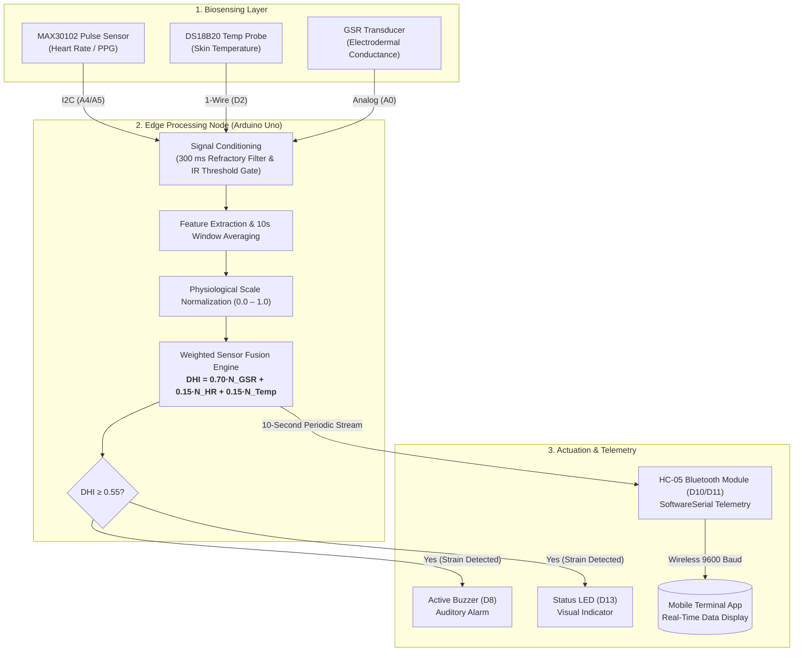

# Multimodal Body Sensor Network for Real-Time Dehydration Monitoring

[](https://www.arduino.cc/)
[](https://www.arduino.cc/)
[](LICENSE)
[]()

A wearable Body Sensor Network (BSN) designed to evaluate clinical hydration status in real time using edge-computed sensor fusion. By combining cardiovascular, thermal, and electrodermal biosignals on an Arduino Uno edge node, the system computes a continuous **Dehydration Hazard Index (DHI)** and broadcasts real-time diagnostic telemetry via Bluetooth.
> ### ⚠️ Academic Project Context
> This repository documents an undergraduate **Level 4, Term II (4-2)** academic project on **Body Sensor Networks (BSN)** completed at the Department of Biomedical Engineering, CUET[cite: 1].
> * **Data Limitations**: Sensor readings and empirical records were gathered in varied, exploratory conditions for prototype demonstration[cite: 1]. The data has **not been clinically validated** against medical gold standards (e.g., blood osmolarity or urine specific gravity)[cite: 1].
> * **Publication Status**: This work is an unpublished engineering proof-of-concept and is intended solely for educational, portfolio, and prototyping reference.

## System Architecture



## Microcontroller Pin Mapping

| Sensor / Component | Arduino Uno Pin | Protocol / Interface | Operating Specs | Description |
| :--- | :--- | :--- | :--- | :--- |
| **MAX30102** | `A4` (SDA), `A5` (SCL) | I2C | 3.3V / 5V | Optical Heart Rate & PPG acquisition |
| **DS18B20** | `D2` | 1-Wire | 5V (4.7kΩ pull-up) | Precision skin surface temperature |
| **GSR Sensor** | `A0` | Analog In | 0–5V | Electrodermal skin conductance |
| **HC-05 (TX)** | `D10` | SoftwareSerial (RX) | 5V TTL | Wireless Bluetooth reception |
| **HC-05 (RX)** | `D11` | SoftwareSerial (TX) | 3.3V Logic Level | Wireless telemetry transmission |
| **Active Buzzer** | `D8` | Digital Out | 5V | Local auditory strain alert |
| **Status LED** | `D13` | Digital Out | Built-in | Local visual strain indicator |

## Mathematical Formulation

### 1. Physiological Normalization
Raw parameters are mapped to a unitless [0.0, 1.0] boundary across physiological human extremes:

$$N_{GSR} = \frac{GSR_{raw}}{1023.0}$$

$$N_{HR} = \max\left(0, \frac{HR_{raw} - 40.0}{160.0}\right)$$

$$N_{Temp} = \max\left(0, \frac{Temp_{raw} - 20.0}{20.0}\right)$$

### 2. Dehydration Hazard Index (DHI)
The normalized features are integrated using empirically determined physiological weights:

$$DHI = (0.70 \times N_{GSR}) + (0.15 \times N_{HR}) + (0.15 \times N_{Temp})$$

* **Threshold Trigger**: An alarm state is engaged whenever $DHI \ge 0.55$, corresponding to the clinical "Moderate Strain" threshold derived from Moran's Physiological Strain Index (PSI).

## Signal Processing & Artifact Rejection

* **10-Second Averaging Window**: Replaces naive peak-counting methods to eliminate movement-induced rate jumps.
* **300 ms Refractory Blanking**: Filters secondary peaks occurring within 300 ms (≤ 200 BPM physiological cap) to reject motion artifacts.
* **Optical Finger Gate**: Enforces an infrared intensity baseline ($IR > 20000$) to prevent spurious floating calculations when unattached.

## Empirical Study & Results

Testing on 30 subjects across a 3-hour fluid restriction protocol demonstrated a **43.5% mean drop in skin conductance** ($72.92\,\mu\text{S} \rightarrow 41.15\,\mu\text{S}$), proving electrodermal activity to be the primary indicator of fluid loss.

### Real-Time System Evaluation

| Timestamp | Heart Rate (BPM) | Skin Temp (°C) | GSR Raw | Computed DHI | Diagnostic Status |
| :--- | :--- | :--- | :--- | :--- | :--- |
| `03:39:03` | 96 | 35.44 | 441.8 | 0.44 | Normal |
| `03:41:58` | 84 | 35.63 | 424.7 | 0.42 | Normal |
| `03:42:06` | 84 | 35.63 | 425.3 | 0.43 | Normal |
| `03:46:19` | 84 | 35.30 | 425.0 | 0.45 | Normal |

## Project Directory Structure

```text
├── .gitignore
├── LICENSE
├── README.md
├── src/
│   └── dehydration_monitor.ino
├── hardware/
│   └── pin_mapping.md
└── data/
    └── empirical_dehydration_study.csv
```

## Getting Started

### Required Arduino Libraries
Install the following via the Arduino IDE Library Manager (**Sketch** $\rightarrow$ **Include Library** $\rightarrow$ **Manage Libraries...**):
* `SparkFun MAX3010x Pulse and Proximity Sensor Library`
* `OneWire` (by Jim Studt, Paul Stoffregen)
* `DallasTemperature` (by Miles Burton)

### Flashing the Microcontroller
1. Connect the Arduino Uno to your workstation via USB.
2. Open `src/dehydration_monitor.ino` in the Arduino IDE.
3. Select **Tools** $\rightarrow$ **Board** $\rightarrow$ **Arduino Uno**.
4. Select the matching serial port under **Tools** $\rightarrow$ **Port**.
5. Click **Upload** (`Ctrl + U` / `Cmd + U`).
6. Pair your PC or mobile device to the `HC-05` Bluetooth terminal (Default PIN: `1234` or `0000`) at **9600 baud** to view real-time diagnostics.

## Authors

* **Sifat Chowdhury** - *Department of Biomedical Engineering, Chittagong University of Engineering & Technology (CUET)* - [u2011015@cuet.ac.bd](mailto:u2011015@student.cuet.ac.bd)
* **Dip Paul** - *Department of Biomedical Engineering, Chittagong University of Engineering & Technology (CUET)* - [u2011025@cuet.ac.bd](mailto:u2011025@student.cuet.ac.bd)
