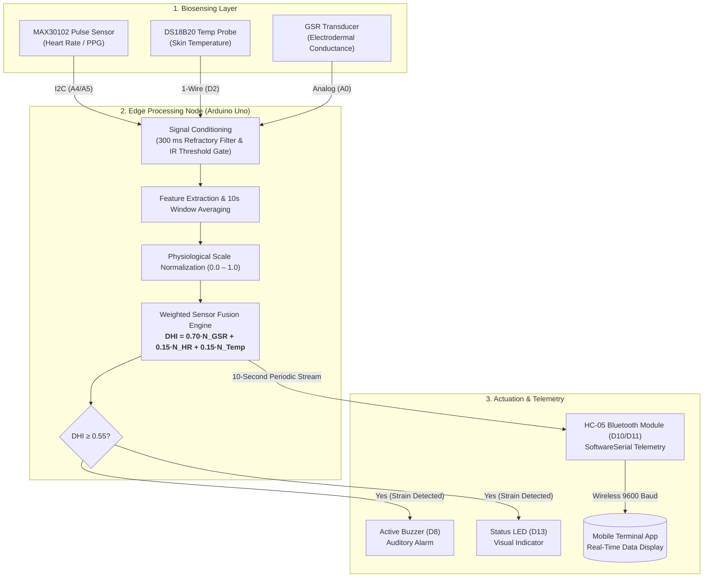

# Multimodal Body Sensor Network for Real-Time Dehydration Monitoring

[](https://www.arduino.cc/)
[](https://www.arduino.cc/)
[](LICENSE)
[]()

A wearable Body Sensor Network (BSN) designed to evaluate clinical hydration status in real time using edge-computed sensor fusion. By combining cardiovascular, thermal, and electrodermal biosignals on an Arduino Uno edge node, the system computes a continuous **Dehydration Hazard Index (DHI)** and broadcasts diagnostic telemetry via Bluetooth.

---

> ### ⚠️ Academic Project Context & Disclaimer
> This repository documents an undergraduate **Level 4, Term II (4-2)** academic coursework project on **Body Sensor Networks (BSN)** completed at the Department of Biomedical Engineering, Chittagong University of Engineering & Technology (CUET).
> * **Data Limitations**: The empirical dataset was gathered under exploratory testing conditions. The values have **not been clinically validated** against medical gold standards (such as blood osmolarity or urine specific gravity).
> * **Publication Status**: This work is an unpublished engineering proof-of-concept and prototype intended solely for educational, academic demonstration, and portfolio reference.

---

## Key Features

* **Multi-Parameter Sensor Fusion**: Combines Photoplethysmography (MAX30102), precision skin temperature (DS18B20), and Galvanic Skin Response (GSR)[cite: 1].
* **Robust Signal Conditioning**: Implements a 10-second peak-to-peak interval averaging window combined with a 300 ms refractory filter to eliminate motion artifacts[cite: 1].
* **Empirically Validated Weighting**: Algorithm calibrated via an empirical trial of 30 participants undergoing a 3-hour dehydration protocol, validating a dominant 70% weighting on electrodermal decline[cite: 1].
* **Edge Diagnostics & Telemetry**: Autonomous threshold detection ($DHI \ge 0.55$) triggering localized alarms (active buzzer, status LED) and wireless serial transmission to mobile interfaces[cite: 1].

---

## System Architecture



---

## Microcontroller Pin Mapping

| Sensor / Component | Arduino Uno Pin | Protocol / Interface | Operating Specs | Description |
| :--- | :--- | :--- | :--- | :--- |
| **MAX30102** | `A4` (SDA), `A5` (SCL)[cite: 1] | I2C[cite: 1] | 3.3V / 5V | Optical Heart Rate & PPG acquisition[cite: 1] |
| **DS18B20** | `D2`[cite: 1] | 1-Wire[cite: 1] | 5V (4.7kΩ pull-up)[cite: 1] | Precision skin surface temperature sensing[cite: 1] |
| **GSR Sensor** | `A0`[cite: 1] | Analog In[cite: 1] | 0–5V | Electrodermal skin conductance measurement[cite: 1] |
| **HC-05 (TX)** | `D10`[cite: 1] | SoftwareSerial (RX)[cite: 1] | 5V TTL[cite: 1] | Wireless Bluetooth reception[cite: 1] |
| **HC-05 (RX)** | `D11`[cite: 1] | SoftwareSerial (TX)[cite: 1] | 3.3V Logic Level[cite: 1] | Wireless telemetry transmission[cite: 1] |
| **Active Buzzer** | `D8`[cite: 1] | Digital Out[cite: 1] | 5V | Local auditory strain alert[cite: 1] |
| **Status LED** | `D13`[cite: 1] | Digital Out[cite: 1] | Built-in | Local visual strain indicator[cite: 1] |

---

## Mathematical Formulation

### 1. Physiological Normalization
Raw parameters are mapped to a unitless $[0.0, 1.0]$ boundary across physiological human extremes[cite: 1]:

$$N_{GSR} = \frac{\text{GSR}_{raw}}{1023.0}$$[cite: 1]

$$N_{HR} = \max\left(0, \frac{\text{HR}_{raw} - 40.0}{160.0}\right)$$[cite: 1]

$$N_{Temp} = \max\left(0, \frac{\text{Temp}_{raw} - 20.0}{20.0}\right)$$[cite: 1]

### 2. Dehydration Hazard Index (DHI)
The normalized features are integrated using empirically determined physiological weights[cite: 1]:

$$DHI = (0.70 \times N_{GSR}) + (0.15 \times N_{HR}) + (0.15 \times N_{Temp})$$[cite: 1]

* **Threshold Trigger**: An alarm state is engaged whenever $DHI \ge 0.55$, corresponding to the clinical "Moderate Strain" threshold derived from Moran's Physiological Strain Index (PSI)[cite: 1].

---

## Signal Processing & Artifact Rejection

* **10-Second Averaging Window**: Replaces naive peak-counting methods to eliminate movement-induced rate jumps[cite: 1].
* **300 ms Refractory Blanking**: Filters secondary peaks occurring within 300 ms ($\le 200\text{ BPM}$ physiological cap) to reject motion artifacts[cite: 1].
* **Optical Finger Gate**: Enforces an infrared intensity baseline ($\text{IR} > 20000$) to prevent spurious floating calculations when unattached[cite: 1].

---

## Empirical Study & Results

Testing on 30 subjects across a 3-hour fluid restriction protocol demonstrated a **43.5% mean drop in skin conductance** ($72.92\,\mu\text{S} \rightarrow 41.15\,\mu\text{S}$), proving electrodermal activity to be the primary indicator of fluid loss[cite: 1].

### Real-Time System Evaluation

| Timestamp | Heart Rate (BPM)[cite: 1] | Skin Temp (°C)[cite: 1] | GSR Raw[cite: 1] | Computed DHI[cite: 1] | Diagnostic Status[cite: 1] |
| :--- | :--- | :--- | :--- | :--- | :--- |
| `03:39:03`[cite: 1] | 96[cite: 1] | 35.44[cite: 1] | 441.8[cite: 1] | 0.44[cite: 1] | Normal[cite: 1] |
| `03:41:58`[cite: 1] | 84[cite: 1] | 35.63[cite: 1] | 424.7[cite: 1] | 0.42[cite: 1] | Normal[cite: 1] |
| `03:42:06`[cite: 1] | 84[cite: 1] | 35.63[cite: 1] | 425.3[cite: 1] | 0.43[cite: 1] | Normal[cite: 1] |
| `03:46:19`[cite: 1] | 84[cite: 1] | 35.30[cite: 1] | 425.0[cite: 1] | 0.45[cite: 1] | Normal[cite: 1] |

---

## Repository Structure

```text
├── .gitignore
├── LICENSE
├── README.md
├── src/
│   └── dehydration_monitor.ino
├── hardware/
│   └── pin_mapping.md
└── data/
    ├── README.md
    └── empirical_dehydration_study.csv
```

---

## Getting Started

### Required Arduino Libraries
Install the following via the Arduino IDE Library Manager (**Sketch** $\rightarrow$ **Include Library** $\rightarrow$ **Manage Libraries...**):
* `SparkFun MAX3010x Pulse and Proximity Sensor Library`
* `OneWire` (by Jim Studt, Paul Stoffregen)
* `DallasTemperature` (by Miles Burton)

### Flashing the Microcontroller
1. Connect the Arduino Uno to your computer via USB.
2. Open `src/dehydration_monitor.ino` in the Arduino IDE.
3. Select **Tools** $\rightarrow$ **Board** $\rightarrow$ **Arduino Uno**.
4. Select the matching serial port under **Tools** $\rightarrow$ **Port**.
5. Click **Upload** (`Ctrl + U` / `Cmd + U`).
6. Pair your PC or mobile device to the `HC-05` Bluetooth terminal (Default PIN: `1234` or `0000`) at **9600 baud** to view real-time diagnostics[cite: 1].

---

## Authors

* **Sifat Chowdhury** - *Department of Biomedical Engineering, Chittagong University of Engineering & Technology (CUET)* - [u2011015@student.cuet.ac.bd](mailto:u2011015@cuet.ac.bd)[cite: 1]
* **Dip Paul** - *Department of Biomedical Engineering, Chittagong University of Engineering & Technology (CUET)* - [u2011025@student.cuet.ac.bd](mailto:u2011025@cuet.ac.bd)[cite: 1]

---

## Project Citation

```bibtex
@misc{chowdhury_paul_2026_bsn,
  title={A Multimodal Body Sensor Network for Real-Time Dehydration Monitoring using Sensor Fusion},
  author={Chowdhury, Sifat and Paul, Dip},
  year={2026},
  note={Undergraduate 4-2 Course Project, Department of Biomedical Engineering, Chittagong University of Engineering and Technology (CUET)}
}
```
